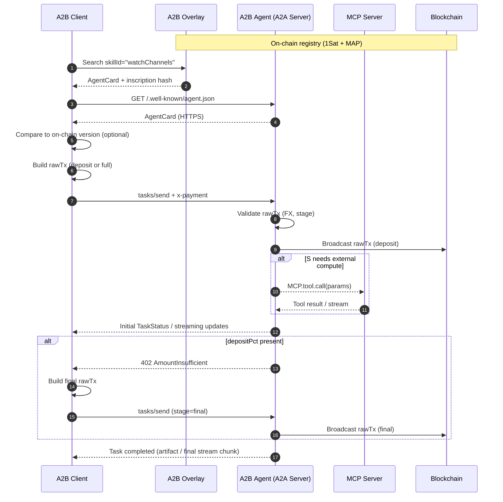

# A2B (Agent‑to‑Bitcoin)  
*A payment + discovery extension for Google A2A*

---

## Table of Contents
1. [Purpose & Scope](#purpose--scope)  
2. [Key Concepts](#key-concepts)  
3. [End‑to‑End Flow (Diagram)](#end-to-end-flow-diagram)  
4. [Data Structures](#data-structures)  
   * 4.1 [Pricing Configuration (`x-payment-config`)](#pricing-configuration)  
   * 4.2 [Payment Claim (`x-payment` DataPart)](#payment-claim)  
   * 4.3 [Agent Card Examples](#agent-card-examples)  
5. [Payment Flow](#payment-flow)  
   * 5.1 [Two‑Stage Deposit Model](#two-stage-deposit-model)  
   * 5.2 [FX Conversion & Price Feeds](#fx-conversion--price-feeds)  
   * 5.3 [Error Codes](#error-codes)  
6. [On‑Chain Registry](#on-chain-registry)  
   * 6.1 [1Sat Ordinal + MAP Format](#1sat-ordinal--map-format)  
   * 6.2 [Updating via Re‑inscription](#updating-via-re-inscription)  
   * 6.3 [Discovery API Requirements](#discovery-api-requirements)  
7. [Protocol Guidelines](#protocol-guidelines)  
8. [Security & Robustness](#security--robustness)  
9. [Payment Verification Algorithm](#payment-verification-algorithm)  
10. [Implementation Guide](#implementation-guide)  
11. [Glossary](#glossary)

---

## 1  Purpose & Scope<a id="purpose--scope"></a>

A2B overlays **crypto‑native payments** and a **permissionless registry** on top of Google’s **Agent‑to‑Agent (A2A)** protocol:

| Feature            | Mechanism / Standard                                                                                                         |
|--------------------|------------------------------------------------------------------------------------------------------------------------------|
| Pricing            | `x-payment-config` block in AgentCard – anchor `currency`, `amount`, human `name`, `acceptedCurrencies`, intervals, deposits |
| Payment            | Client signs rawTx → embeds in `x-payment` → **server broadcasts** only on task success (*pay‑on‑success*)                   |
| Discovery          | AgentCards stored as **1‑satoshi Ordinal inscriptions** with MAP tag `app=your-app-name type=a2b`                            |
| Ownership & Update | Re‑inscribe the satoshi to update pricing/metadata; inscription (and service reputation) can be bought/sold like an NFT      |

Currency‑agnostic: examples use **BSV**, **BTC**, **SOL**, and fiat **USD**.

---

## 2  Key Concepts<a id="key-concepts"></a>

| Term / Concept          | Description                                                                                          |
|-------------------------|-------------------------------------------------------------------------------------------------------|
| **Pricing Config**      | One entry in `x-payment-config`; has machine `id` and human `name`                                    |
| **skillIds**            | Array of A2A Skill ID **strings** (not friendly names)                                                |
| **acceptedCurrencies**  | Required list of tickers agent accepts (must include anchor `currency`)                               |
| **depositPct**          | Fraction (0–1) for two‑stage payments (`deposit` + `final`)                                           |
| **interval**            | `null`, shorthand (`day|week|month|year`), or ISO 8601 duration (e.g. `"P18M"` for 18 months)         |
| **priceFeedUrl**        | Optional oracle endpoint returning spot FX rates `{ "rates": { "BTC":0.000012 } }`                    |
| **MCP Server**          | Local server exposing Model‑Context‑Protocol tools; may be called by an A2A server during a task      |

---

## 3  End‑to‑End Flow (Diagram)<a id="end-to-end-flow-diagram"></a>

> GitHub renders Mermaid natively in Markdown files.



---

## 4  Data Structures<a id="data-structures"></a>

### 4.1  Pricing Configuration<a id="pricing-configuration"></a>

```jsonc
{
  "id": "watchtower-18m",
  "name": "18‑Month Enterprise Watchtower",
  "currency": "BSV",
  "amount": 0.030,
  "address": "1WatchtowerAddr",
  "acceptedCurrencies": ["BSV","BTC","USD"],
  "depositPct": 0.20,
  "priceFeedUrl": "https://oracle.example/spot",
  "interval": "P18M",
  "skillIds": ["watchChannels"],
  "description": "Long‑term SLA ‑ 20 % up‑front, 80 % on success"
}
```

### 4.2  Payment Claim (`x-payment` DataPart)<a id="payment-claim"></a>

```jsonc
{
  "type": "data",
  "data": {
    "x-payment": {
      "configId": "dex-chart-sub-month",
      "stage": "full",
      "rawTx": "<hex>",
      "currency": "SOL",
      "refundAddress": "solRefundPubKey"
    }
  }
}
```

### 4.3  Agent Card Examples<a id="agent-card-examples"></a>

#### **A. Tower‑Guard Watch Services**

```jsonc
{
  "name": "Tower‑Guard Watch Services",
  "url": "https://watchtower.example",
  "version": "2.1.0",
  "capabilities": { "streaming": true, "pushNotifications": true },
  "skills": [
    { "id": "watchChannels", "name": "Lightning Watchtower" }
  ],
  "x-payment-config": [
    {
      "id": "watchtower-month",
      "name": "30‑Day Watchtower",
      "currency": "BSV",
      "amount": 0.002,
      "address": "1WatchtowerAddr",
      "acceptedCurrencies": ["BSV","BTC","USD"],
      "interval": "month",
      "skillIds": ["watchChannels"],
      "description": "Penalty‑tx monitoring for 30 days"
    },
    {
      "id": "watchtower-18m",
      "name": "18‑Month Enterprise Watchtower",
      "currency": "BSV",
      "amount": 0.030,
      "address": "1WatchtowerAddr",
      "acceptedCurrencies": ["BSV","BTC","USD"],
      "interval": "P18M",
      "depositPct": 0.20,
      "skillIds": ["watchChannels"],
      "description": "Long‑term SLA; 20 % up‑front, 80 % on completion"
    }
  ]
}
```

#### **B. On‑Chain DEX Chart API**

```jsonc
{
  "name": "On‑Chain DEX Chart API",
  "url": "https://dexcharts.example",
  "version": "1.0.0",
  "capabilities": { "streaming": false },
  "skills": [
    { "id": "getDexChart", "name": "DEX Chart JSON" }
  ],
  "x-payment-config": [
    {
      "id": "dex-chart-call",
      "name": "Single OHLCV Request",
      "currency": "USD",
      "amount": 0.05,
      "address": "1DexDataAddr",
      "acceptedCurrencies": ["USD","BSV","SOL"],
      "skillIds": ["getDexChart"],
      "description": "Returns 500‑candle OHLCV JSON"
    },
    {
      "id": "dex-chart-sub-month",
      "name": "Unlimited Charts · 30 Days",
      "currency": "USD",
      "amount": 20,
      "address": "1DexDataAddr",
      "acceptedCurrencies": ["USD","BSV","SOL"],
      "interval": "month",
      "skillIds": ["getDexChart"],
      "description": "Unlimited OHLCV queries for one month"
    }
  ]
}
```

---

## 5  Payment Flow<a id="payment-flow"></a>

1. **Discover** AgentCard (overlay → HTTPS) and verify on‑chain hash.  
2. **Prepare** rawTx paying `address` in any `acceptedCurrencies` value.  
3. **Embed** `x-payment` DataPart with `stage:"deposit"` or `"full"`.  
4. **Submit** via `tasks/send` or `tasks/sendSubscribe`.  
5. **Validate** – server checks amount, FX, stage, duplicate txid.  
6. **Broadcast** rawTx (deposit or full).  
7. **Execute** task; may call MCP tools.  
8. **Optionally send 402** for `stage:"final"` if using deposit model.  
9. **Broadcast** final rawTx, mark `completed`, return artifact / stream.  
10. **Fail** – if job fails, discard rawTx; client keeps funds.

### 5.1  Two‑Stage Deposit Model<a id="two-stage-deposit-model"></a>

| Stage   | Required rawTx value (after FX)     | Who sends rawTx | Who broadcasts |
|---------|--------------------------------------|-----------------|----------------|
| deposit | `amount × depositPct`               | Client          | **Server**     |
| final   | `amount − deposit`                  | Client          | **Server**     |
| full    | `amount`                            | Client          | **Server**     |

### 5.2  FX Conversion & Price Feeds<a id="fx-conversion--price-feeds"></a>

* Conversion formula:  
  `required = anchorAmount × spotRate(anchor→payCurrency)`  
* `spotRate` fetched from `priceFeedUrl` or server’s oracle; cache ≤ 60 s.  
* Slippage tolerance default ±1 %; configurable per service.

### 5.3  Error Codes<a id="error-codes"></a>

| HTTP | JSON‑RPC code | Message Stub                        |
|------|---------------|-------------------------------------|
| 402  | `-32030`      | PaymentMissing                      |
| 402  | `-32031`      | PaymentInvalid (rawTx)              |
| 402  | `-32032`      | StageMismatch                       |
| 402  | `-32033`      | AmountInsufficient                  |
| 402  | `-32034`      | CurrencyUnsupported / AddressMismatch |

---

## 6  On‑Chain Registry<a id="on-chain-registry"></a>

### 6.1  1Sat Ordinal + MAP Format<a id="1sat-ordinal--map-format"></a>

```
Output 0 (1 sat):
  <P2PKH>
  OP_FALSE OP_IF
    "ord"
    OP_1 "application/json"
    OP_0 <AgentCard bytes>
  OP_ENDIF OP_RETURN
    "1PuQa7K62MiKCtssSLKy1kh56WWU7MtUR5"
    "SET" "app" "your-app-name" "type" "a2b"
```

### 6.2  Updating via Re‑inscription<a id="updating-via-re-inscription"></a>

* Spend the inscription satoshi to a new output you control.  
* Attach a new ord envelope with updated AgentCard.  
* Add identical MAP tag line.  
* Overlays pick the newest inscription per satoshi.

### 6.3  Discovery API Requirements<a id="discovery-api-requirements"></a>

| Query Parameter        | Purpose                                            |
|------------------------|----------------------------------------------------|
| `skillId`              | Filter configs containing the skill ID             |
| `currency`             | Anchor currency filter                             |
| `acceptedCurrency`     | Agents accepting a specific ticker                 |
| `interval`             | Filter by billing period (e.g. `month`, `P18M`)    |
| `maxPrice.amount`      | Upper bound in anchor currency                     |
| `updateHeight`         | Only inscriptions newer than given block height    |

---

## 7  Protocol Guidelines<a id="protocol-guidelines"></a>

| Mode / Scenario     | Guidelines                                                                                      |
|---------------------|--------------------------------------------------------------------------------------------------|
| Immediate Task      | Use `stage:"full"` when `depositPct` omitted; broadcast on success.                              |
| Streaming Task      | Require deposit at start; allow server to withhold final chunk until `stage:"final"`.            |
| Interactive Session | One payment per Task ID; switch to subscription (`interval`) if conversation becomes lengthy.    |
| Long‑Running Job    | Recommend `depositPct ≥ 0.5`; split into milestones if runtime > 24 h.                           |
| Subscription Plan   | Each interval is its own task & pricing config (`interval`); server tracks expiry.               |
| MCP Tool Calls      | Server may call MCP endpoints; A2B governs only client↔server settlement.                        |

---

## 8  Security Considerations<a id="security--robustness"></a>

* **Grace Timeout** – Default 30 min for missing `final` stage.  
* **Task Expiry** – Cancel tasks and refund deposits if no success within policy window.  
* **RawTx Storage** – Encrypt pending rawTxs at rest.  
* **Rate Limits** – Cost‑based throttling (e.g. satoshis / second per IP).  
* **Double Spend** – Check inputs unspent at broadcast time.

---

## 9  Payment Verification Algorithm<a id="payment-verification-algorithm"></a>

```pseudo
verifyAndBroadcast(rawTx, stage, cfg, payTicker):
    tx     = decode(rawTx)
    output = findOutput(tx, cfg.address)
    if !output                -> 32034
    anchor = stage == 'deposit'
             ? cfg.amount * (cfg.depositPct or 1)
             : stage == 'final'
             ? cfg.amount - cfg.amount*(cfg.depositPct or 0)
             : cfg.amount
    fxRate = payTicker == cfg.currency
             ? 1
             : fetchSpot(payTicker, cfg.currency, cfg.priceFeedUrl)
    required = anchor * fxRate
    if output.value < required*(1 - slippage): -> 32033
    if txidInMempoolOrChain(tx.id):            -> 32031
    broadcast(tx)
```

---

## 10  Implementation Guide<a id="implementation-guide"></a>

### Client Workflow

1. **Discover** ‑ call overlay:  
   `GET /agents?skillId=watchChannels&acceptedCurrency=BTC`.  
2. **Verify** ‑ compare inscription hash ↔ HTTPS `agent.json`.  
3. **Prepare** ‑ sign rawTx ≥ required value (after FX).  
4. **Send** ‑ `tasks/send` with DataPart `x-payment`.  
5. **Handle** ‑ if `402 / AmountInsufficient`, construct `stage:"final"` rawTx and resend.  
6. **Confirm** ‑ watch mempool/chain for server broadcast.

### Server Workflow

1. **Publish** ‑ inscribe AgentCard (`type=a2b`).  
2. **Validate** ‑ verify rawTx value, stage, FX.  
3. **Execute** ‑ optionally call MCP tools; stream progress.  
4. **Broadcast** ‑ rawTx on success; mark `completed`.  
5. **Fail** ‑ discard rawTx, mark task `failed`.  
6. **Update** ‑ re‑inscribe satoshi to change pricing/metadata.

---

## 11  Glossary<a id="glossary"></a>

| Term                 | Definition                                                     |
|----------------------|----------------------------------------------------------------|
| **1Sat Ordinal**     | An inscription controlling a single satoshi (Bitcoin SV model) |
| **MAP**              | Magic Attribute Protocol: `OP_RETURN 1PuQa7K… SET key val …`   |
| **ISO 8601 `P18M`**  | Duration literal “Period 18 Months”.                           |
| **Skill ID**         | Canonical ID of an A2A skill (e.g. `watchChannels`).           |
| **MCP**              | *Model‑Context Protocol* – tool‑invocation layer; orthogonal to A2B. |

---

*End of comprehensive specification (2025‑04‑18).*  