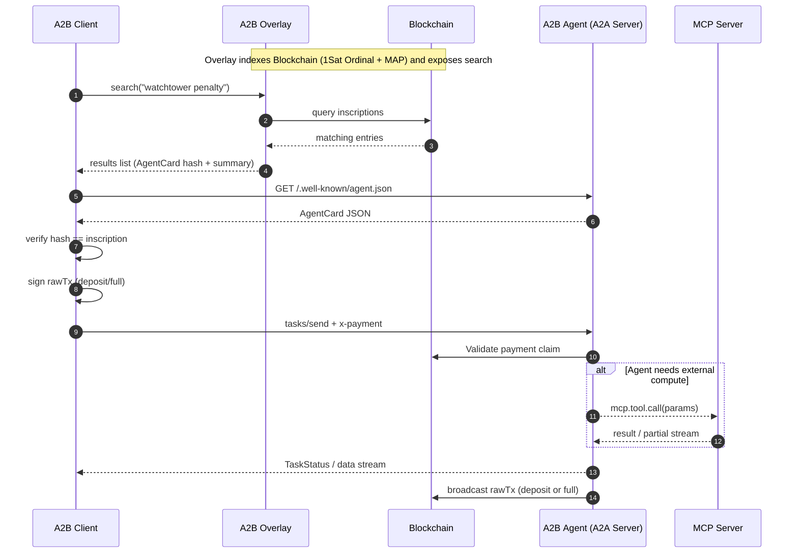
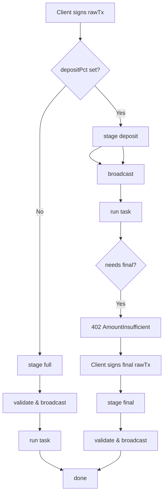
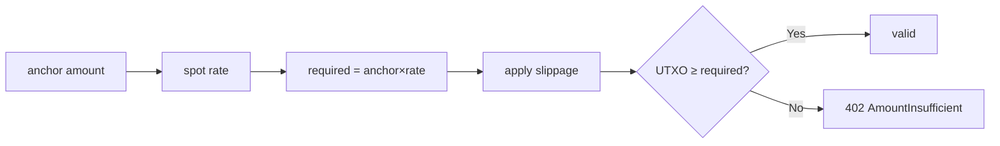
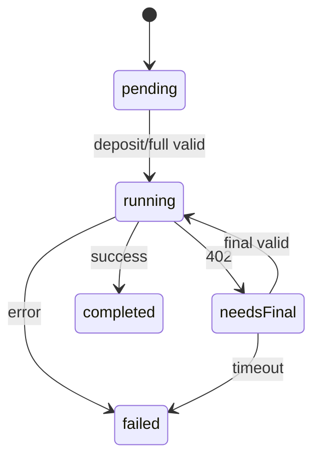
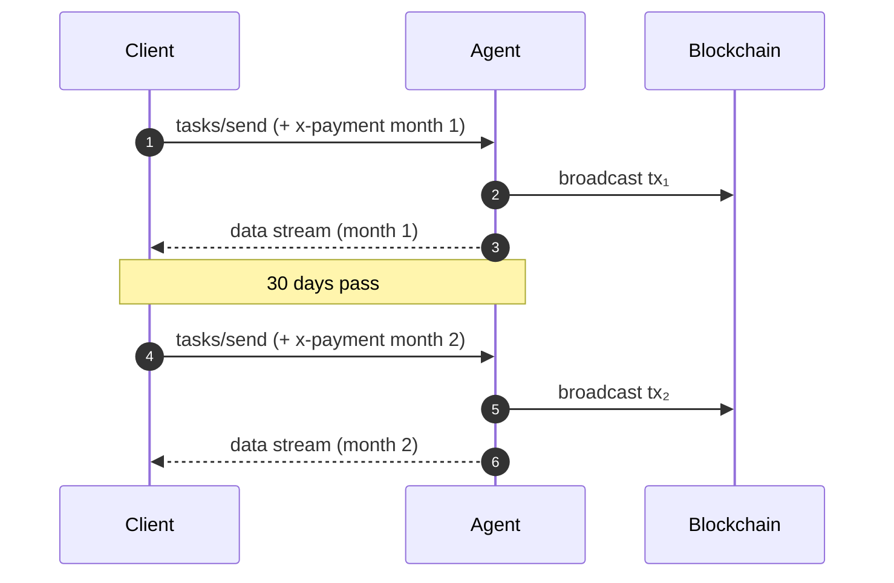
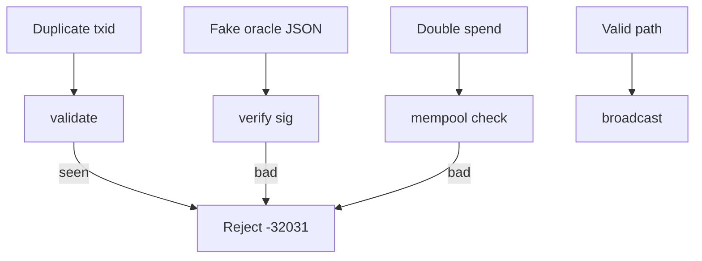

# A2B (Agent‑to‑Bitcoin)  
*A payment + discovery extension for Google A2A*

---

## Table of Contents
1. [Purpose & Scope](#purpose--scope)  
2. [Key Concepts](#key-concepts)  
3. [End‑to‑End Flow (Diagram)](#end-to-end-flow-diagram)  
4. [Data Structures](#data-structures)  
   * 4.1 [Pricing Configuration (`x-payment-config`)](#pricing-configuration)  
   * 4.2 [Payment Claim (`x-payment` DataPart)](#payment-claim)  
   * 4.3 [Agent Card Examples](#agent-card-examples)  
5. [Payment Flow](#payment-flow)  <!-- section stub; content in Part 2 -->  

---

## 1  Purpose & Scope<a id="purpose--scope"></a>

A2B overlays **crypto‑native payments** and a **permissionless satoshi registry** on Google’s **Agent‑to‑Agent (A2A)** protocol:

| Capability          | Mechanism / Standard                                                                                                          |
|---------------------|--------------------------------------------------------------------------------------------------------------------------------|
| Pricing             | `x-payment-config` — anchor `currency`, `amount`, human `name`, `acceptedCurrencies`, `interval`, optional `depositPct`        |
| Payment             | Client signs rawTx → embeds in `x-payment` → **server broadcasts** only on success (*pay‑on‑success*)                          |
| Discovery           | AgentCards are **1‑satoshi Ordinal inscriptions** with MAP tag `app=your‑app‑name type=a2b`                                    |
| Ownership & Update  | Re‑inscribe that satoshi to update metadata; inscription (and reputation) is portable & tradeable                             |
| Tooling (MCP)       | A2A servers may invoke **MCP tool servers** during execution; A2B covers only *client ↔ agent* settlement                      |

Currency‑agnostic — examples use **BSV**, **BTC**, **SOL**, and fiat **USD**.

---

## 2  Key Concepts<a id="key-concepts"></a>

| Concept                | Definition |
|------------------------|------------|
| **Pricing Config**     | One entry in `x-payment-config`; machine `id`, human `name`, price, currencies. |
| **skillIds**           | Array of A2A Skill ID strings (`"watchChannels"`, `"getDexChart"`, …). |
| **acceptedCurrencies** | Required tickers the agent accepts (must include anchor). |
| **depositPct**         | 0–1 fraction enabling two‑stage payments (`deposit` + `final`). |
| **interval**           | `null`, shorthand (`day | week | month | year`), or ISO 8601 duration like `"P18M"`. |
| **priceFeedUrl**       | Optional oracle used by the service to determine price of accepted and anchor currencies returning `{ "rates": { "BTC": 0.000012 } }`. |
| **Overlay**            | A2B discovery index (marketplace‑style fuzzy search). |
| **MCP Server**         | Local Model‑Context‑Protocol tool host an agent may call. |

---

## 3  End‑to‑End Flow (Diagram)<a id="end-to-end-flow-diagram"></a>



---

## 4  Data Structures<a id="data-structures"></a>

### Type Definitions

```typescript
/** On‑chain pricing entry */
export interface PricingConfig {
  id: string;
  name: string;
  currency: string;            // anchor ticker
  amount: number;              // price in anchor units
  address: string;             // pay‑to address for anchor currency
  acceptedCurrencies: string[]; // other tickers accepted
  skillIds: string[];          // skills this price unlocks
  interval?: 'day'|'week'|'month'|'year'|string|null;
  description?: string|null;
  depositPct?: number;         // 0‑1 for two‑stage payments
  priceFeedUrl?: string;       // optional FX oracle
}

/** DataPart claim sent with tasks/send */
export interface PaymentClaim {
  configId: string;
  stage: 'deposit' | 'final' | 'full';
  rawTx: string;               // hex‑encoded unsigned or signed tx
  currency: string;            // ticker of UTXO value
  refundAddress?: string;      // optional alt‑chain refund
}
```

### 4.1  Pricing Configuration<a id="pricing-configuration"></a>

**Minimal**

```jsonc
{
  "id": "wt-basic",
  "name": "Basic Pay‑Per‑Call",
  "currency": "BSV",
  "amount": 0.0005,
  "address": "1WatchtowerAddr",
  "acceptedCurrencies": ["BSV"],
  "skillIds": ["watchChannels"]
}
```

<details>
<summary>Extensive</summary>

```jsonc
{
  "id": "watchtower-18m",
  "name": "18‑Month Enterprise Watchtower",
  "currency": "BSV",
  "amount": 0.030,
  "address": "1WatchtowerAddr",
  "acceptedCurrencies": ["BSV","BTC","USD"],
  "depositPct": 0.20,
  "priceFeedUrl": "https://oracle.example/spot",
  "interval": "P18M",
  "skillIds": ["watchChannels"],
  "description": "Long‑term SLA — 20 % up‑front, 80 % on success."
}
```
</details>

### 4.2  Payment Claim (`x-payment` DataPart)<a id="payment-claim"></a>

**Minimal**

```jsonc
{
  "type": "data",
  "data": {
    "x-payment": {
      "configId": "wt-basic",
      "stage": "full",
      "rawTx": "<hex>",
      "currency": "BSV"
    }
  }
}
```

<details>
<summary>Extensive</summary>

```jsonc
{
  "type": "data",
  "data": {
    "x-payment": {
      "configId": "dex-chart-sub-month",
      "stage": "deposit",
      "rawTx": "<signed‑hex>",
      "currency": "SOL",
      "refundAddress": "solRefundPubKey"
    }
  }
}
```
</details>

### 4.3  Agent Card Examples<a id="agent-card-examples"></a>

#### Watchtower Agent — Minimal

```jsonc
{
  "name": "Tower‑Guard (Minimal)",
  "url": "https://watchtower.example",
  "version": "1.0.0",
  "capabilities": {},
  "skills": [
    { "id": "watchChannels", "name": "Watch Lightning Channels" }
  ],
  "x-payment-config": [
    { "id": "wt-basic", "name": "Basic Pay‑Per‑Call", "currency": "BSV", "amount": 0.0005, "address": "1WatchtowerAddr","acceptedCurrencies": ["BSV"],"skillIds": ["watchChannels"] }
  ]
}
```

<details>
<summary>Watchtower Agent — Extensive</summary>

```jsonc
{
  "name": "Tower‑Guard Watch Services",
  "url": "https://watchtower.example",
  "version": "2.1.0",
  "capabilities": {
    "streaming": true,
    "pushNotifications": true,
    "stateTransitionHistory": true
  },
  "skills": [
    {
      "id": "watchChannels",
      "name": "Lightning Watchtower",
      "description": "Monitors LN channels and broadcasts penalty transactions.",
      "tags": ["lightning","security","fraud-prevention"],
      "examples": [
        "watch channel 0234abcd… for 30 days",
        "monitor my node for revoked states"
      ],
      "inputModes": ["data"],
      "outputModes": ["stream"]
    }
  ],
  "x-payment-config": [
    {
      "id": "watchtower-month",
      "name": "30‑Day Watchtower",
      "currency": "BSV",
      "amount": 0.002,
      "address": "1WatchtowerAddr",
      "acceptedCurrencies": ["BSV","BTC","USD"],
      "interval": "month",
      "skillIds": ["watchChannels"],
      "description": "Penalty‑tx monitoring for 30 days."
    },
    {
      "id": "watchtower-18m",
      "name": "18‑Month Enterprise Watchtower",
      "currency": "BSV",
      "amount": 0.030,
      "address": "1WatchtowerAddr",
      "acceptedCurrencies": ["BSV","BTC","USD"],
      "interval": "P18M",
      "depositPct": 0.20,
      "priceFeedUrl": "https://oracle.example/spot",
      "skillIds": ["watchChannels"],
      "description": "Long‑term SLA; 20 % deposit, 80 % on completion."
    }
  ]
}
```
</details>

#### DEX Chart Agent — Minimal

```jsonc
{
  "name": "DEX Chart API (Minimal)",
  "url": "https://dexcharts.example",
  "version": "1.0.0",
  "capabilities": {},
  "skills": [
    { "id": "getDexChart", "name": "DEX Chart JSON" }
  ],
  "x-payment-config": [
    {
      "id": "dex-chart-call",
      "name": "Single OHLCV Snapshot",
      "currency": "USD",
      "amount": 0.05,
      "address": "1DexDataAddr",
      "acceptedCurrencies": ["USD"],
      "skillIds": ["getDexChart"]
    }
  ]
}
```

<details>
<summary>DEX Chart Agent — Extensive</summary>

```jsonc
{
  "name": "On‑Chain DEX Chart API",
  "url": "https://dexcharts.example",
  "version": "1.0.0",
  "capabilities": { "streaming": false },
  "skills": [
    {
      "id": "getDexChart",
      "name": "DEX Chart JSON",
      "description": "Returns OHLCV data for any on‑chain DEX pair.",
      "tags": ["markets","dex","charts"],
      "examples": ["dex chart BSV/USDC 1h 500"],
      "inputModes": ["text"],
      "outputModes": ["data"]
    }
  ],
  "x-payment-config": [
    {
      "id": "dex-chart-call",
      "name": "Single OHLCV Snapshot",
      "currency": "USD",
      "amount": 0.05,
      "address": "1DexDataAddr",
      "acceptedCurrencies": ["USD","BSV","SOL"],
      "skillIds": ["getDexChart"],
      "description": "Returns 500‑candle OHLCV JSON."
    },
    {
      "id": "dex-chart-sub-month",
      "name": "Unlimited Charts · 30 Days",
      "currency": "USD",
      "amount": 20,
      "address": "1DexDataAddr",
      "acceptedCurrencies": ["USD","BSV","SOL"],
      "interval": "month",
      "skillIds": ["getDexChart"],
      "description": "Unlimited OHLCV queries for one month."
    }
  ]
}
```
</details>

---

## 5  Payment Flow<a id="payment-flow"></a>

A2B’s payment logic has three variants — *full*, *deposit + final* and *subscription*. The client always signs a raw transaction but **only the server broadcasts** it once the task reaches the corresponding stage.

<details>
<summary>Mermaid · Deposit vs Full Path</summary>


</details>

### 5.1  Two‑Stage Deposit Model<a id="two-stage-deposit-model"></a>

| Stage   | RawTx ≥ (after FX) | Sender | Broadcast |
|---------|--------------------|--------|-----------|
| deposit | `amount × depositPct` | Client | Server |
| final   | `amount − deposit`    | Client | Server |
| full    | `amount`              | Client | Server |

---

### 5.2  FX Conversion & Price Feeds<a id="fx-conversion--price-feeds"></a>

<details>
<summary>Mermaid · FX Math & Slippage</summary>


</details>

* Oracle JSON example: `{ "rates": { "USD": 123.45, "BTC": 0.000014 } }`
* Default slippage tolerance: **±1 %** (override per pricing config).

### 5.3  Error Codes<a id="error-codes"></a>

| HTTP | JSON‑RPC code | Meaning                       |
|------|---------------|-------------------------------|
| 402  | `-32030`      | PaymentMissing                |
| 402  | `-32031`      | PaymentInvalid (rawTx)        |
| 402  | `-32032`      | StageMismatch                 |
| 402  | `-32033`      | AmountInsufficient            |
| 402  | `-32034`      | CurrencyUnsupported / AddressMismatch |

---

### 5.4  Task State Machine

<details>
<summary>Mermaid · Task States</summary>


</details>

---

### 5.5  Subscription Renewal Flow

<details>
<summary>Mermaid · Monthly Subscription Sequence</summary>


</details>

---

## 6  On‑Chain Registry<a id="on-chain-registry"></a>

### 6.1  1Sat Ordinal + MAP Format<a id="1sat-ordinal--map-format"></a>

```
Output 0 (1 sat):
  <P2PKH>
  OP_FALSE OP_IF
    "ord"
    OP_1 "application/json"
    OP_0 <AgentCard bytes>
  OP_ENDIF

Output 1 (0 sat):
  OP_RETURN
    1PuQa7K62MiKCtssSLKy1kh56WWU7MtUR5  SET
    app your-app-name  type a2b
```

### 6.2  Updating via Re‑inscription<a id="updating-via-re-inscription"></a>

Spend the satoshi, attach a new envelope with updated card and identical MAP; newest wins.

### 6.3  Overlay Search UX<a id="overlay-search-ux"></a>

* Fuzzy search over `name`, `description`, `tags`.  
* Filters: `skillId`, `acceptedCurrency`, `interval`, `maxPrice`.  
* Result card shows logo, summary, cheapest price, update height, rating.
### 6.4  Cross‑Chain Registry Compatibility

Full 1‑sat‑style inscriptions are effortless on **Bitcoin SV** (design target), but other ledgers impose tighter data caps or higher gas costs. The table ranks practicality for storing *the entire `agent.json`* versus a lightweight pointer.

| Chain | Native data capacity (per tx / script) | Full JSON on‑chain | Pointer variant¹ | Notes |
|-------|----------------------------------------|--------------------|------------------|-------|
| **Bitcoin SV** | OP_FALSE+ord ≈ 100 kB | ✅ | — | Native design. |
| **Bitcoin (Taproot)** | Witness pushes ≤ 520 B, unlimited chunks (Ordinals) | ⚠️ costly | ✅ | Same inscription flow; high fee/weight. |
| **Litecoin (Taproot)** | BTC rules, cheaper fees | ⚠️ | ✅ | LTC‑20 shows viability. |
| **Bitcoin Cash** | OP_RETURN total 223 B | ❌ | ✅ | Store hash + URL only. |
| **Dogecoin** | OP_RETURN 80 B | ❌ | ✅ | Use multi‑output “Stamps” style. |
| **Ethereum / EVM** | Calldata / storage; ~16 k gas / byte | ⚠️ very expensive | ✅ | Emit LOG event with hash + IPFS; full storage = $$$. |
| **Solana** | Account data ≤ 10 MB | ✅ | — | Rent‑exempt account holds JSON. |
| **Avalanche / Polygon / BSC** | EVM rules, cheaper gas | ⚠️ | ✅ | Pointer is practical; full JSON still big. |

**Legend**  ✅ feasible · ⚠️ feasible but high cost/complexity · ❌ impractical  
¹ *Pointer variant* = small MAP record containing a SHA‑256 hash and URI of the card.

#### Pointer Variant Specification

```text
OP_RETURN
  1PuQa7K62MiKCtssSLKy1kh56WWU7MtUR5  SET
  app your-app-name  type a2b
  hash <32‑byte‑hex>
  uri  https://example.com/.well-known/agent.json
```

> **Overlay behaviour** – When the indexer encounters a `hash / uri` record, it **must**:  
> 1. Download the referenced `.well-known/agent.json`.  
> 2. Verify `SHA‑256(body) == hash`.  
> 3. Parse and ingest the JSON exactly as if it were stored on‑chain, so the agent’s metadata remains fully searchable.

Using pointers lets *any* UTXO or EVM chain participate in A2B discovery with only ~75 bytes on‑chain, while still providing strong integrity via hash verification.

---

#### Why BSV Comes First

* Supports large ord‑style envelopes in‑script, no size kludges.  
* Ultra‑low fees (< $0.001 for 10 kB) enable updates & rich metadata.  
* Re‑inscription model = identical to BTC/LTC Taproot flow, easing future multichain parity.

Other chains can join immediately via the pointer method, then migrate to full on‑chain JSON if/when their ecosystems adopt high‑capacity inscription tech (e.g., BTC ordinals, Ethereum blobs / proto‑danksharding  [oai_citation_attribution:9‡investopedia.com](https://www.investopedia.com/what-you-need-to-know-ahead-of-ethereum-dencun-update-wednesday-8607518?utm_source=chatgpt.com)).

---

## 7  Protocol Guidelines<a id="protocol-guidelines"></a>

| Scenario         | Recommendation |
|------------------|----------------|
| Immediate        | `stage:"full"`; server broadcasts on success. |
| Streaming        | Deposit then `final`; server withholds last chunk until paid. |
| Interactive      | One payment per task; switch to subscription for heavy usage. |
| Long‑Running     | Deposit ≥ 50 % or milestone split. |
| Subscription     | One config per billing interval (`interval`). |
| MCP Payments     | Agent may embed nested A2B hop for downstream tools. |

---

## 8  Security Considerations<a id="security-considerations"></a>

<details>
<summary>Mermaid · Threat Mitigation Flow</summary>


</details>

* Grace timeout 30 min for missing `final`.  
* Refund deposits on task expiry. 
* Rate‑limit by satoshi/s & requests.  
* Double‑spend detection before broadcast.  
* Verify signed oracle feeds.

---

## 9  Payment Verification Algorithm<a id="payment-verification-algorithm"></a>

```pseudo
verifyAndBroadcast(rawTx, stage, cfg, payTicker):
    tx   = decode(rawTx)
    out  = findOutput(tx, cfg.address)
    if !out           -> 32034
    anchor = (stage=='deposit') ? cfg.amount*cfg.depositPct
           : (stage=='final')   ? cfg.amount - cfg.amount*cfg.depositPct
           : cfg.amount
    rate = (payTicker==cfg.currency) ? 1
         : fetchSpot(payTicker, cfg.currency, cfg.priceFeedUrl)
    needed = anchor * rate
    if out.value < needed*(1-slippage): -> 32033
    if txidSeen(tx.id):                 -> 32031
    broadcast(tx)
```

---

## 10  Implementation Guide<a id="implementation-guide"></a>

### Client
1. Search overlay; choose pricing config.  
2. Verify AgentCard hash.  
3. Sign rawTx.  
4. `tasks/send` + `x-payment`.  
5. Handle `402` (deposit model) & resend `final`.  
6. Watch mempool for server broadcast.

### Server
1. Inscribe AgentCard (`type=a2b`).  
2. Validate payment claim.  
3. Execute task; call MCP tools if needed.  
4. Broadcast rawTx; stream updates.  
5. Re‑inscribe satoshi for updates.

---

## 11  Glossary<a id="glossary"></a>

| Term                 | Definition |
|----------------------|------------|
| **1Sat Ordinal**     | Single‑satoshi inscription registry entry. |
| **MAP**              | Magic Attribute Protocol key‑value OP_RETURN. |
| **Skill ID**         | Identifier in AgentCard `skills[].id`. |
| **ISO 8601 Duration**| `"P18M"` = 18 months. |
| **Overlay**          | A2B discovery marketplace. |
| **MCP**              | Model‑Context Protocol tool host. |

---

*Specification version 2025‑04‑18.*