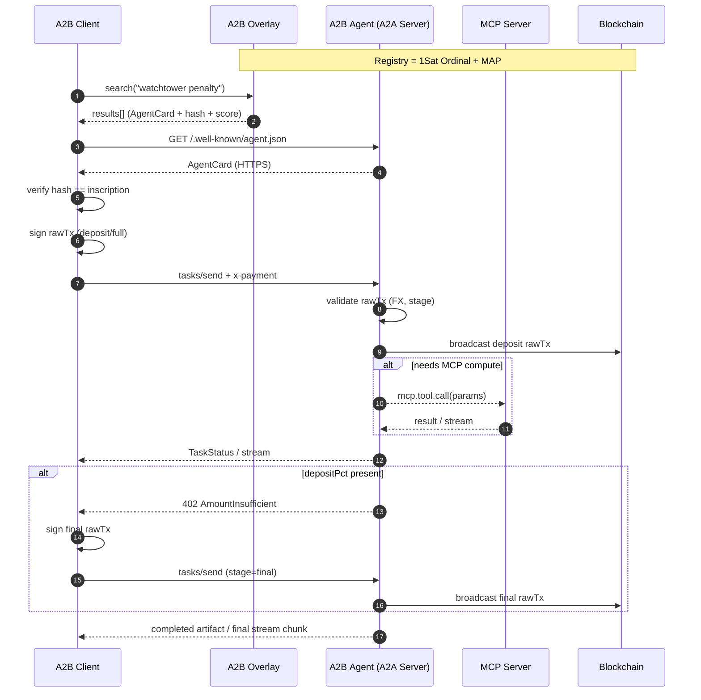
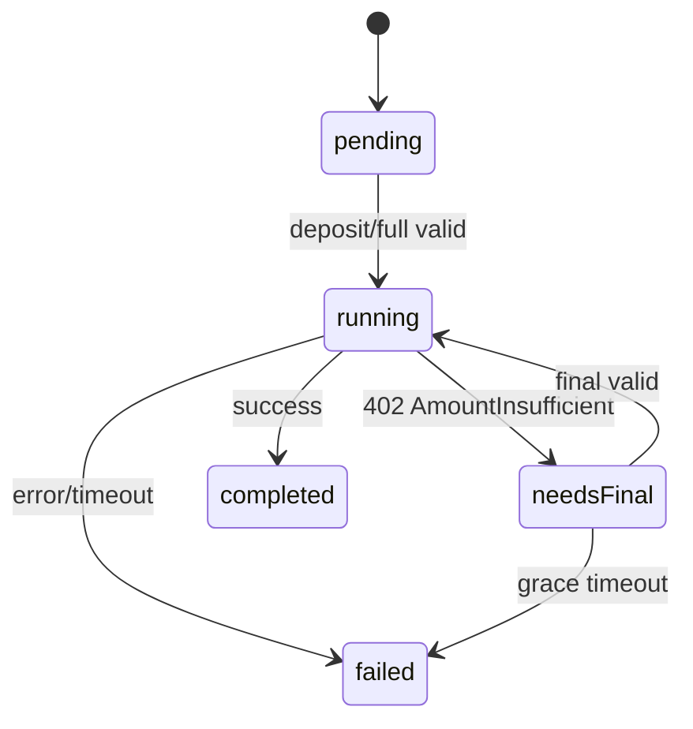
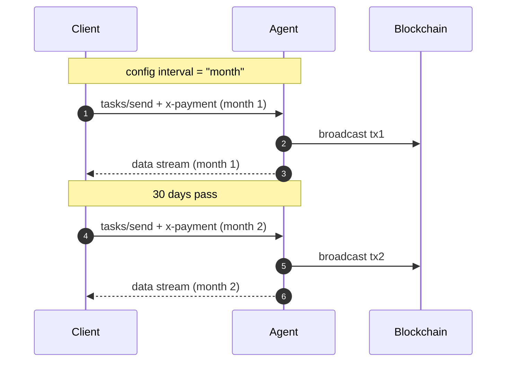
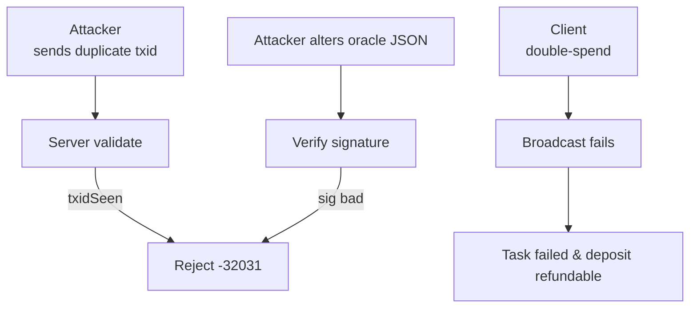

# A2B (Agent‑to‑Bitcoin)  
*A payment + discovery extension for Google A2A*

---

## Table of Contents
1. [Purpose & Scope](#purpose--scope)  
2. [Key Concepts](#key-concepts)  
3. [End‑to‑End Flow (Diagram)](#end-to-end-flow-diagram)  
4. [Data Structures](#data-structures)  
   * 4.1 [Pricing Configuration (`x-payment-config`)](#pricing-configuration)  
   * 4.2 [Payment Claim (`x-payment` DataPart)](#payment-claim)  
   * 4.3 [Agent Card Examples](#agent-card-examples)  
5. [Payment Flow](#payment-flow)  
   * 5.1 [Two‑Stage Deposit Model](#two-stage-deposit-model)  
   * 5.2 [FX Conversion & Price Feeds](#fx-conversion--price-feeds)  
   * 5.3 [Error Codes](#error-codes)  
6. [On‑Chain Registry](#on-chain-registry) ••• **continues in Part 2** •••  

---

## 1  Purpose & Scope<a id="purpose--scope"></a>

A2B overlays **crypto‑native payments** and a **permissionless satoshi registry** on top of Google’s **Agent‑to‑Agent (A2A)** protocol:

| Capability          | Mechanism / Standard                                                                                                             |
|---------------------|-----------------------------------------------------------------------------------------------------------------------------------|
| Pricing             | `x-payment-config` — anchor `currency`, `amount`, human‑readable `name`, `acceptedCurrencies`, `interval`, optional `depositPct` |
| Payment             | Client signs rawTx → embeds in `x-payment` → **server broadcasts** only on success (*pay‑on‑success*)                             |
| Discovery           | AgentCards are **1‑satoshi Ordinal inscriptions** with MAP tag `app=your‑app‑name type=a2b`                                       |
| Ownership & Update  | Re‑inscribe that satoshi to change metadata; inscription (and reputation) is portable & tradeable                                |
| Tooling (MCP)       | An A2A server may invoke **MCP tool servers** internally; A2B handles only *client ↔ agent* settlement                            |

Currency‑agnostic — examples use **BSV**, **BTC**, **SOL**, and fiat **USD**.

---

## 2  Key Concepts<a id="key-concepts"></a>

| Concept                | Definition |
|------------------------|------------|
| **Pricing Config**     | One entry in `x-payment-config`; machine `id`, human `name`, price, currencies. |
| **skillIds**           | Array of A2A Skill ID strings (`"watchChannels"`, `"getDexChart"`, …). |
| **acceptedCurrencies** | Required tickers the agent accepts (must include anchor). |
| **depositPct**         | 0–1 fraction for two‑stage payments (`deposit` + `final`). |
| **interval**           | `null`, shorthand (`day|week|month|year`), or ISO 8601 duration like `"P18M"`. |
| **priceFeedUrl**       | Optional oracle returning `{ "rates": { "BTC": 0.000012 } }`. |
| **Overlay**            | A2B discovery index w/ VS‑Code‑style fuzzy search. |
| **MCP Server**         | Local Model‑Context‑Protocol tool host an agent may call. |

---

## 3  End‑to‑End Flow (Diagram)<a id="end-to-end-flow-diagram"></a>



---

## 4  Data Structures<a id="data-structures"></a>

### 4.1  Pricing Configuration<a id="pricing-configuration"></a>

**Minimal**

```jsonc
{
  "id": "wt-basic",
  "name": "Basic Pay‑Per‑Call",
  "currency": "BSV",
  "amount": 0.0005,
  "address": "1WatchtowerAddr",
  "acceptedCurrencies": ["BSV"],
  "skillIds": ["watchChannels"]
}
```

<details>
<summary>Extensive</summary>

```jsonc
{
  "id": "watchtower-18m",
  "name": "18‑Month Enterprise Watchtower",
  "currency": "BSV",
  "amount": 0.030,
  "address": "1WatchtowerAddr",
  "acceptedCurrencies": ["BSV","BTC","USD"],
  "depositPct": 0.20,
  "priceFeedUrl": "https://oracle.example/spot",
  "interval": "P18M",
  "skillIds": ["watchChannels"],
  "description": "Long‑term SLA — 20 % up‑front, 80 % on success."
}
```
</details>

### 4.2  Payment Claim (`x-payment` DataPart)<a id="payment-claim"></a>

**Minimal**

```jsonc
{
  "type": "data",
  "data": {
    "x-payment": {
      "configId": "wt-basic",
      "stage": "full",
      "rawTx": "<hex>",
      "currency": "BSV"
    }
  }
}
```

<details>
<summary>Extensive</summary>

```jsonc
{
  "type": "data",
  "data": {
    "x-payment": {
      "configId": "dex-chart-sub-month",
      "stage": "deposit",
      "rawTx": "<signed‑hex>",
      "currency": "SOL",
      "refundAddress": "solRefundPubKey"
    }
  }
}
```
</details>

### 4.3  Agent Card Examples<a id="agent-card-examples"></a>

#### Watchtower Agent — Minimal

```jsonc
{
  "name": "Tower‑Guard (Minimal)",
  "url": "https://watchtower.example",
  "version": "1.0.0",
  "capabilities": {},
  "skills": [
    { "id": "watchChannels", "name": "Watch Lightning Channels" }
  ],
  "x-payment-config": [
    { "id": "wt-basic", "name": "Basic Pay‑Per‑Call", "currency": "BSV", "amount": 0.0005, "address": "1WatchtowerAddr","acceptedCurrencies": ["BSV"],"skillIds": ["watchChannels"] }
  ]
}
```

<details>
<summary>Watchtower Agent — Extensive</summary>

```jsonc
{
  "name": "Tower‑Guard Watch Services",
  "url": "https://watchtower.example",
  "version": "2.1.0",
  "capabilities": {
    "streaming": true,
    "pushNotifications": true,
    "stateTransitionHistory": true
  },
  "skills": [
    {
      "id": "watchChannels",
      "name": "Lightning Watchtower",
      "description": "Monitors LN channels and broadcasts penalty transactions.",
      "tags": ["lightning","security","fraud-prevention"],
      "examples": [
        "watch channel 0234abcd… for 30 days",
        "monitor my node for revoked states"
      ],
      "inputModes": ["data"],
      "outputModes": ["stream"]
    }
  ],
  "x-payment-config": [
    {
      "id": "watchtower-month",
      "name": "30‑Day Watchtower",
      "currency": "BSV",
      "amount": 0.002,
      "address": "1WatchtowerAddr",
      "acceptedCurrencies": ["BSV","BTC","USD"],
      "interval": "month",
      "skillIds": ["watchChannels"],
      "description": "Penalty‑tx monitoring for 30 days."
    },
    {
      "id": "watchtower-18m",
      "name": "18‑Month Enterprise Watchtower",
      "currency": "BSV",
      "amount": 0.030,
      "address": "1WatchtowerAddr",
      "acceptedCurrencies": ["BSV","BTC","USD"],
      "interval": "P18M",
      "depositPct": 0.20,
      "priceFeedUrl": "https://oracle.example/spot",
      "skillIds": ["watchChannels"],
      "description": "Long‑term SLA; 20 % deposit, 80 % on completion."
    }
  ]
}
```
</details>

#### DEX Chart Agent — Minimal

```jsonc
{
  "name": "DEX Chart API (Minimal)",
  "url": "https://dexcharts.example",
  "version": "1.0.0",
  "capabilities": {},
  "skills": [
    { "id": "getDexChart", "name": "DEX Chart JSON" }
  ],
  "x-payment-config": [
    {
      "id": "dex-chart-call",
      "name": "Single OHLCV Snapshot",
      "currency": "USD",
      "amount": 0.05,
      "address": "1DexDataAddr",
      "acceptedCurrencies": ["USD"],
      "skillIds": ["getDexChart"]
    }
  ]
}
```

<details>
<summary>DEX Chart Agent — Extensive</summary>

```jsonc
{
  "name": "On‑Chain DEX Chart API",
  "url": "https://dexcharts.example",
  "version": "1.0.0",
  "capabilities": { "streaming": false },
  "skills": [
    {
      "id": "getDexChart",
      "name": "DEX Chart JSON",
      "description": "Returns OHLCV data for any on‑chain DEX pair.",
      "tags": ["markets","dex","charts"],
      "examples": ["dex chart BSV/USDC 1h 500"],
      "inputModes": ["text"],
      "outputModes": ["data"]
    }
  ],
  "x-payment-config": [
    {
      "id": "dex-chart-call",
      "name": "Single OHLCV Snapshot",
      "currency": "USD",
      "amount": 0.05,
      "address": "1DexDataAddr",
      "acceptedCurrencies": ["USD","BSV","SOL"],
      "skillIds": ["getDexChart"],
      "description": "Returns 500‑candle OHLCV JSON."
    },
    {
      "id": "dex-chart-sub-month",
      "name": "Unlimited Charts · 30 Days",
      "currency": "USD",
      "amount": 20,
      "address": "1DexDataAddr",
      "acceptedCurrencies": ["USD","BSV","SOL"],
      "interval": "month",
      "skillIds": ["getDexChart"],
      "description": "Unlimited OHLCV queries for one month."
    }
  ]
}
```
</details>

---

## 5  Payment Flow<a id="payment-flow"></a>

*(identical text, plus Mermaid diagrams for deposit model & FX math appear in Part 2)*

---
## 5  Payment Flow (continued)<a id="payment-flow"></a>

<details>
<summary>Mermaid · Deposit vs Full Path</summary>

```mermaid
flowchart TD
    A[Client<br>signs rawTx] --> B{depositPct<br>present?}
    B -- No --> F[stage=full]<br/>→ server validate → broadcast → run task → done
    B -- Yes --> C[stage=deposit]<br/>→ server validate → broadcast
    C --> D[run task]
    D --> E{needs final?}
    E -- success w/ deposit --> G[402 AmountInsufficient]
    G --> H[Client signs final rawTx]
    H --> I[stage=final]<br/>→ server validate → broadcast → done
```
</details>

### 5.1  Two‑Stage Deposit Model<a id="two-stage-deposit-model"></a>

| Stage   | RawTx ≥ (after FX) | Sender | Broadcast |
|---------|--------------------|--------|-----------|
| deposit | `amount×depositPct`| Client | Server    |
| final   | `amount−deposit`   | Client | Server    |
| full    | `amount`           | Client | Server    |

---

### 5.2  FX Conversion & Price Feeds<a id="fx-conversion--price-feeds"></a>

<details>
<summary>Mermaid · FX Math & Slippage</summary>

```mermaid
flowchart LR
    A[anchor amount<br>(cfg.amount)] --> B[spotRate<br>anchor→pay]
    B --> C[required = anchor×rate]
    C --> D[apply slippage<br>(1 − tol)]
    D --> E{UTXO value ≥ required?}
    E -- Yes --> F[valid]
    E -- No --> G[402 AmountInsufficient]
```
</details>

* Oracle JSON: `{ "rates": { "USD":123.45,"BTC":0.000014 } }`  
* Default slippage ±1 %; override per‑service with `slippagePct`.

---

### 5.3  Task State Machine

<details>
<summary>Mermaid · Task States</summary>


</details>

---

### 5.4  Subscription Renewal Example

<details>
<summary>Mermaid · Monthly Subscription Sequence</summary>


</details>

---

## 6  On‑Chain Registry (continued)<a id="on-chain-registry"></a>

### 6.3  Overlay Search UX<a id="overlay-search-ux"></a>

Marketplace‑style search:

* Full‑text over `name`, `description`, `tags`.
* Structured filters: `skillId`, `interval`, `acceptedCurrency`, `maxPrice`.
* Results show card logo, summary, cheapest plan, update height, rating.

---

## 7  Protocol Guidelines<a id="protocol-guidelines"></a>

| Scenario         | Recommendation |
|------------------|----------------|
| Immediate        | `stage:"full"`; server broadcasts on success. |
| Streaming        | Deposit first; final chunk after `stage:"final"`. |
| Interactive      | One payment per task; consider subscription if heavy usage. |
| Long‑Running     | Deposit ≥ 50 % or split milestones. |
| Subscription     | Each billing interval uses its own config (`interval`). |
| MCP Payments     | Optional nested A2B hop for downstream tools. |

---

## 8  Security Considerations<a id="security-considerations"></a>

<details>
<summary>Mermaid · Threat Mitigation Flow</summary>


</details>

* **Grace timeout** — 30 min default for missing `final`.  
* **Task expiry** — refund deposits if job exceeds SLA.  
* **Encrypted rawTx store** — protect pre‑broadcast payments.  
* **Rate limits** — throttle by satoshi/s & request count.  
* **Double‑spend check** — ensure inputs unspent at broadcast.  
* **Signed oracle** — verify HMAC/ECDSA to prevent FX tampering.

---

## 9  Payment Verification Algorithm<a id="payment-verification-algorithm"></a>

```pseudo
verifyAndBroadcast(rawTx, stage, cfg, payTicker):
    tx   = decode(rawTx)
    out  = findOutput(tx, cfg.address)
    if !out                      -> 32034
    anchor = (stage=='deposit') ? cfg.amount*cfg.depositPct
           : (stage=='final')   ? cfg.amount - cfg.amount*cfg.depositPct
           : cfg.amount
    rate = (payTicker==cfg.currency) ? 1
         : fetchSpot(payTicker, cfg.currency, cfg.priceFeedUrl)
    needed = anchor * rate
    if out.value < needed*(1-slippage): -> 32033
    if txidSeen(tx.id):                 -> 32031
    broadcast(tx)
```

---

## 10  Implementation Guide<a id="implementation-guide"></a>

### Client Steps
1. Search overlay (`q=` + filters).  
2. Verify AgentCard hash.  
3. Sign rawTx.  
4. Call `tasks/send` with `x-payment`.  
5. Handle `402` (if deposit model) & resend `final`.  
6. Watch mempool for broadcast.

### Server Steps
1. Inscribe AgentCard (`type=a2b`).  
2. Validate payment claim.  
3. Execute task; invoke MCP tools as needed.  
4. Broadcast rawTx; stream updates.  
5. Re‑inscribe satoshi to update pricing/metadata.

---

## 11  Glossary<a id="glossary"></a>

| Term                 | Definition |
|----------------------|------------|
| **1Sat Ordinal**     | Single‑satoshi inscription used as registry entry. |
| **MAP**              | Magic Attribute Protocol key‑value OP_RETURN. |
| **Skill ID**         | Canonical identifier in AgentCard `skills[].id`. |
| **ISO 8601 Duration**| Example `"P18M"` = 18 months. |
| **Overlay**          | A2B discovery service with marketplace UX. |
| **MCP**              | Model‑Context Protocol tool host. |

---

*Specification version 2025‑04‑18.*  